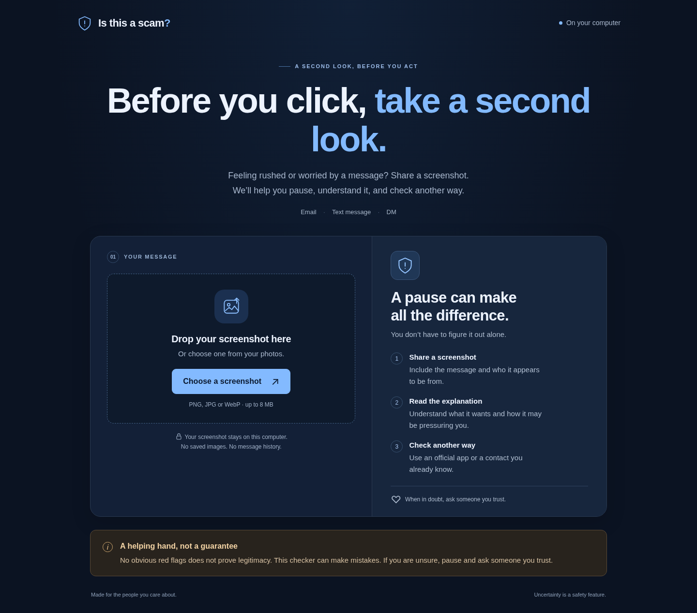

# Is This a Scam?

A tiny local web app for the person who sends you a screenshot and asks, “Does this look suspicious?” Drop in a screenshot of an email, text, or DM. Get a plain-language explanation of what it wants you to do, observable red flags, and a cautious next step.



**Uncertainty is a safety feature.** The app uses exactly three verdicts:

- **Likely scam** — clear scam indicators were found.
- **I'm not sure** — the image or evidence is incomplete or ambiguous.
- **No obvious red flags found** — no clear indicators were found. **This does not prove legitimacy.**

The tool can make mistakes. An automated explanation is a starting point for checking with a trusted person, never authorization to act on a message.

## Run on your own computer

Requirements:

- Node.js **22.18 or newer** (Node 24 LTS recommended), with npm.
- [Ollama](https://ollama.com/download) running on this same computer.
- Enough memory and disk space for `gemma3:4b`. Performance depends on your hardware; a GPU helps. The model download is several gigabytes.

Install Ollama using its official instructions, then download the image-capable model:

```sh
ollama pull gemma3:4b
```

Start Ollama if it is not already running. The desktop app may start it automatically; otherwise, in a separate terminal:

```sh
ollama serve
```

From this project's directory:

```sh
npm ci
npm run dev
```

Open **http://127.0.0.1:3000** in your browser. Choose a PNG, JPG, or WebP screenshot (up to 8 MiB), then press **Check this message**. If something is hard to read, crop to the message and include relevant sender information. You can clear or replace the image at any time.

The first analysis may take longer while the model loads. Requests time out after two minutes and can be retried. The page gives clear messages when Ollama is unavailable or the model is missing.

For a production build running locally:

```sh
npm run build
npm start
```

Both run commands listen on loopback only. This MVP is intended to run on the same computer as Ollama. If you deploy the app on another server, `localhost:11434` refers to that server, and screenshots leave the user's computer. That changes both the connectivity and privacy assumptions. Public hosting is outside this MVP.

## How it works

```text
Screenshot in browser
        ↓
POST /api/analyze on this computer
        ↓
Image validation → local Ollama / gemma3:4b
        ↓
Strict JSON validation → reviewed next-step guidance
        ↓
Plain-language result
```

Ollama reads the image directly; there is no separate OCR service. The endpoint requests a JSON schema with exactly `verdict`, `summary`, `redFlags`, and `recommendedAction`, then validates the output again. Unusable model responses produce an error, not a reassuring verdict. Generated next-step instructions are replaced by reviewed guidance that never asks the user to click, reply, pay, or call using information from the suspicious message. Suspicious URLs are rendered as text, not links.

Screenshot contents are treated as untrusted evidence, including instructions telling the model how to answer. This is a prompt safeguard, not proof of immunity to prompt injection. The summary and red flags are still model-generated and can be misleading.

## Privacy rationale

People's messages often contain personal information. In the intended local setup, screenshots are sent only to the local Next.js process and local Ollama service. There is no application database, screenshot storage, analysis history, analytics, cloud model call, external font, account, or authentication. Next.js telemetry is disabled by the supplied run/build commands.

Processing still requires temporary copies in browser, server, and model memory. Clearing an image removes it from the page; it does not guarantee secure erasure of memory. Your operating system, browser extensions, or separately configured Ollama diagnostics are outside this app's control. Do not share screenshots containing secrets. The app does not log image contents or model responses.

## MVP limitations

- A screenshot cannot prove who sent a message. Display names, logos, and sender details can be forged.
- The model can misread small text, miss cropped context, invent details, or produce an incorrect verdict. Non-English screenshots and unusual layouts have not been comprehensively evaluated.
- The app does not open links, look up domain reputation, examine email headers, check accounts, or authenticate organizations.
- “No obvious red flags found” never proves legitimacy. A malicious message may appear ordinary.
- Conservative prompts and validated JSON cannot guarantee classification accuracy. Even an explanation with the right verdict may contain a factual error.
- This is a local weekend prototype, not an independently evaluated security product. There is no multi-user access control, rate limiting, or public-hosting infrastructure.
- Still images only; animations, unreadable/corrupt files, images over 8 MiB, and images over 20 megapixels are rejected.

## Verification

```sh
npm test
npm run typecheck
npm run build
```

The focused tests cover response validation, upload decoding, request boundaries, and provider errors. Browser tests use controlled responses so they can verify UI behavior without depending on model speed or classification:

```sh
npx playwright install chromium
npm run test:browser
```

On systems with Google Chrome already installed, the test configuration can use it instead of downloading a browser (see `playwright.config.ts`). Synthetic screenshots live in `tests/fixtures/`; they contain no real messages or personal information. To regenerate them:

```sh
node scripts/create-fixtures.ts
```

With the app and Ollama running, test real screenshot inference:

```sh
npm run check:local-model
```

This sends the delivery-fee, ordinary-notification, ambiguous-message, and embedded-instruction fixtures through the same endpoint the browser uses. It prints observed verdicts and explanations and checks a small set of expected fixture behaviors, returning a nonzero exit on a mismatch; it does not claim an accuracy score. See [verification notes](docs/verification.md) for what was actually tested.

## Weekend scope

Started October 2, 2026 for the [DEV Hacktoberfest Weekend Challenge: Build for a Friend](https://dev.to/challenges/hacktoberfest-weekend-2026-10-01). Scope: one page, one endpoint, local image analysis. No auth, database, history, agents, or separate OCR.

The official prompt asks for a new project with open-source AI at its core, built for a real person. Local Ollama and the open-weight Gemma model are the core of this app. A submission still needs a DEV post using the official template: explain who it is for, show a demo, and explain why open innovation matters. Choose the actual loved one and describe their feedback rather than inventing a user story. The deadline is October 5, 2026 at 06:59 UTC (2:59 AM EDT). Check the official rules before submitting; no submission or public deployment has been made.

Once the model is downloaded, local inference lets you analyze a screenshot without sending its contents to a remote model provider. That ownership and privacy rationale is central to this project, along with the explicit uncertainty verdict.

MIT licensed. The Ollama model has its own license and terms; see [Gemma on Ollama](https://ollama.com/library/gemma3).

## Pause before you act

The page puts an independently verified next step before the generated explanation. The model describes the message’s request and any pressure visible in its wording. Uncertain results explain what is visible and what evidence is missing; missing information alone is not a scam indicator. The four-field response and three verdicts stay deliberately small.

Before handing this to your intended friend or loved one, try the delivery-fee, ambiguous-message, and ordinary-notification fixtures together. Ask what they think the message wants, what they would do next, and which wording was confusing. Record their actual feedback in the submission; do not invent a recipient or testimonial. This MVP needs someone to set up Node and Ollama on the computer running it.
